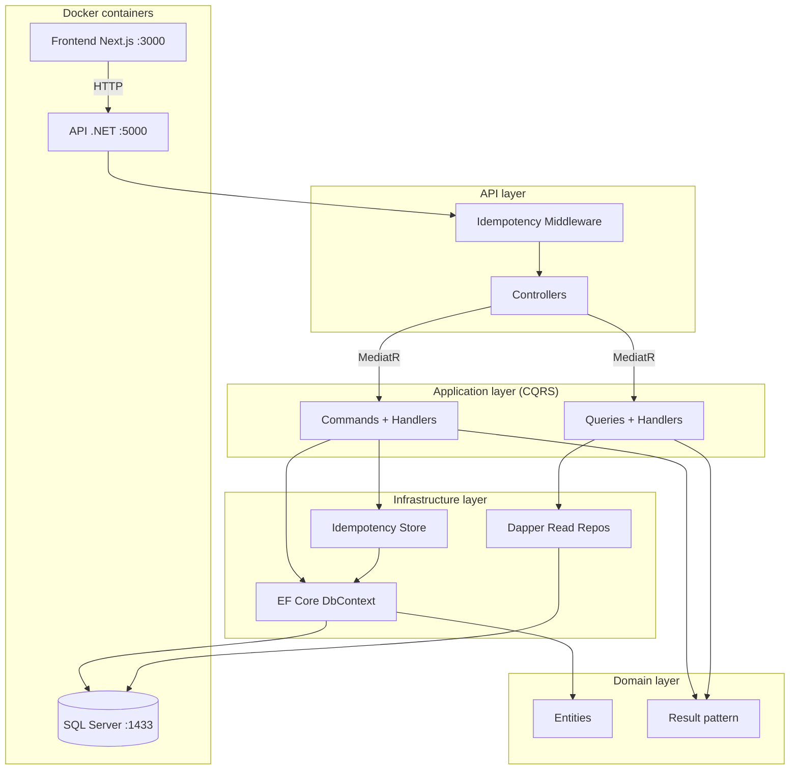

# Architecture diagram (Mermaid)

## CQRS and data flow

- **Write path:** Controller → Command Handler → IAppDbContext (EF Core) → Database.
- **Read path:** Controller → Query Handler → I*ReadRepository (Dapper) → Database.
- **Idempotency:** POST with Idempotency-Key → Middleware → IIdempotencyStore (EF) → return stored response or run handler and store.
- **Result pattern:** Handlers return Result&lt;T&gt;; API maps to 200, 201, 400, 404, 409.
